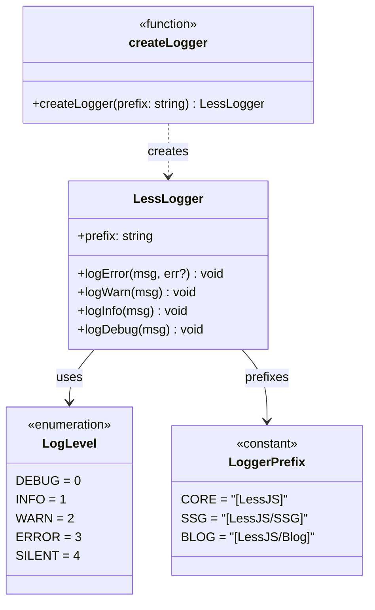
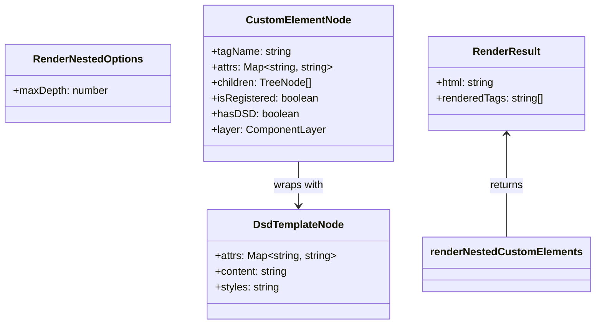
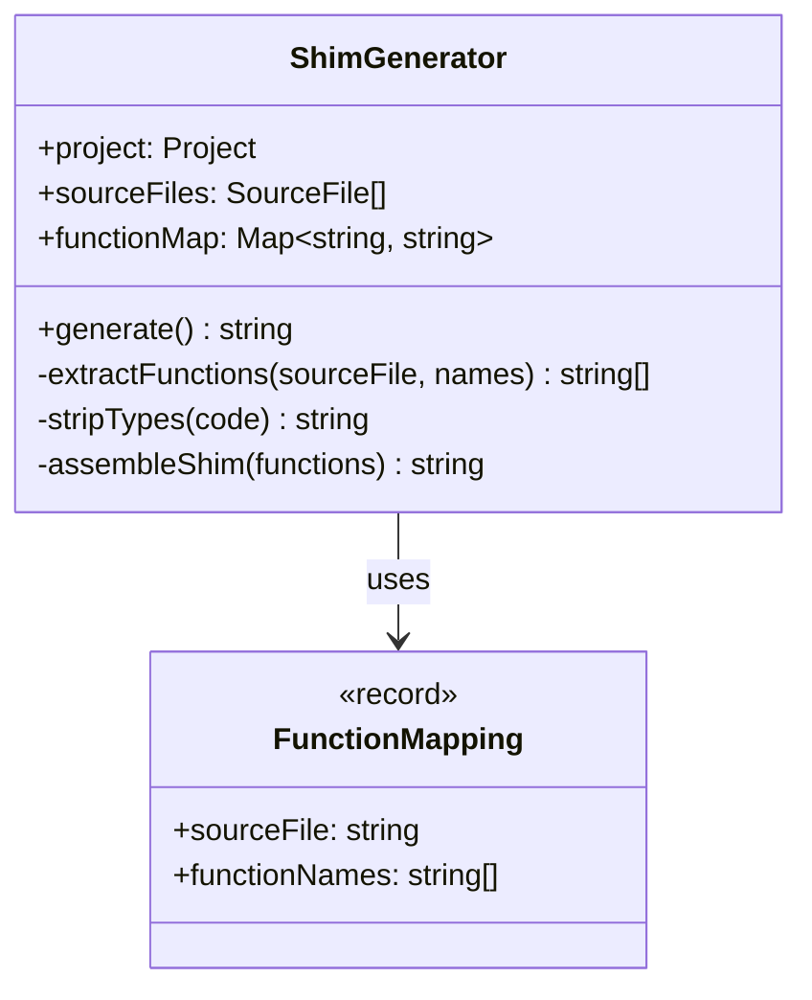
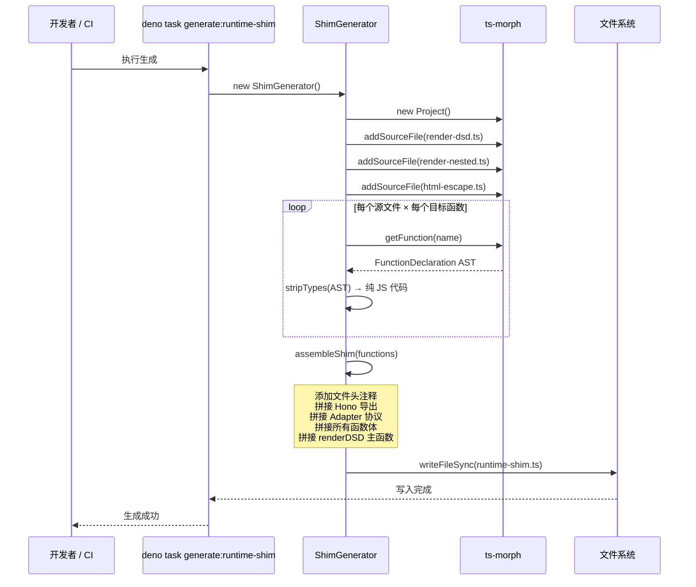
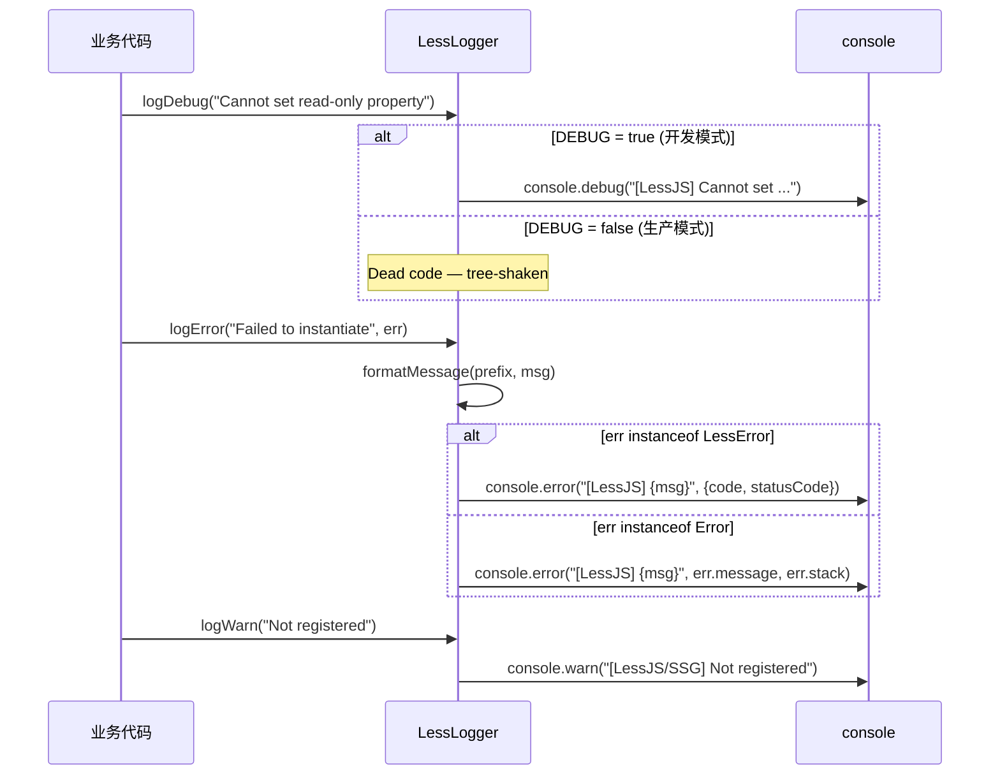
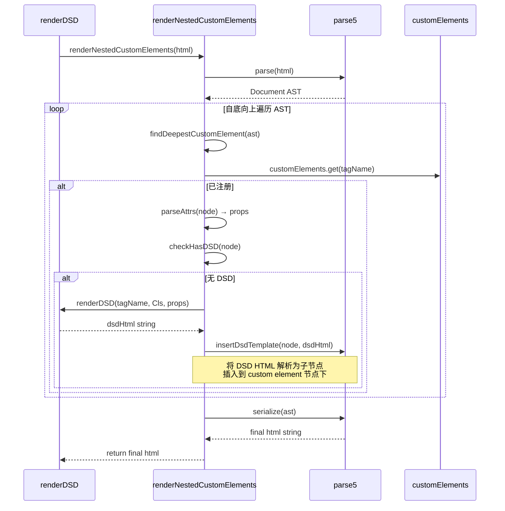
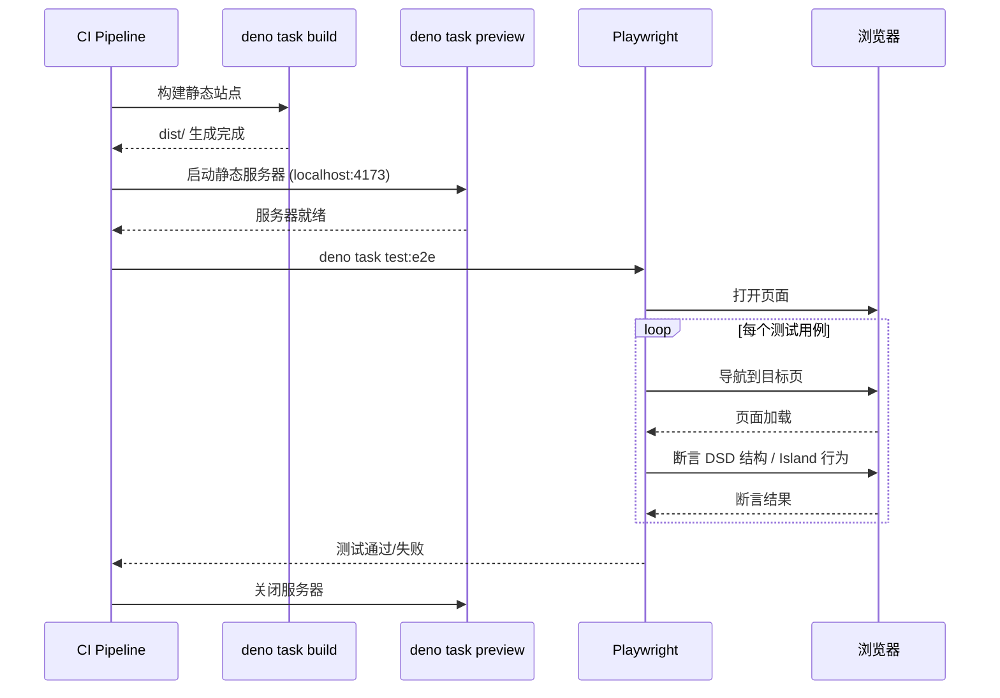
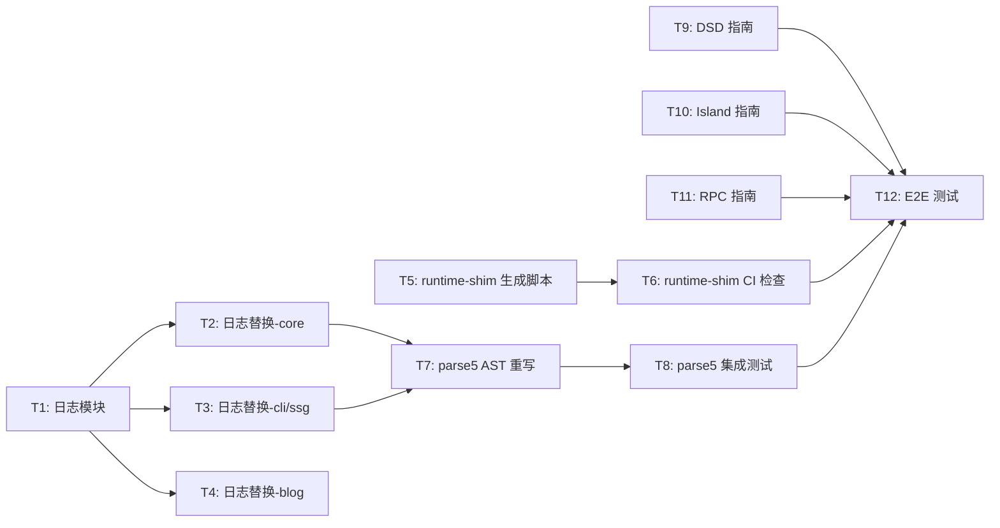

# LessJS v0.8 架构设计文档

> 作者：高见远（Gao）· 架构师 | 日期：2026-05-08
> 基于 PRD v0.8.0 + 主理人 8 项决策

---

## 目录

1. [实现方案 + 框架选型](#1-实现方案--框架选型)
2. [文件列表及相对路径](#2-文件列表及相对路径)
3. [数据结构和接口（类图）](#3-数据结构和接口类图)
4. [程序调用流程（时序图）](#4-程序调用流程时序图)
5. [任务列表](#5-任务列表)
6. [依赖包列表](#6-依赖包列表)
7. [共享知识（跨文件约定）](#7-共享知识跨文件约定)
8. [待明确事项](#8-待明确事项)

---

## 1. 实现方案 + 框架选型

### P0-1: runtime-shim 自动生成

**方案**：新增独立 `deno task generate:runtime-shim`，使用 ts-morph 从 3 个 TS 源文件提取导出函数，生成无类型的 runtime-shim.ts。

**核心思路**：
- ts-morph 解析 `render-dsd.ts`、`render-nested.ts`、`html-escape.ts` 的 AST
- 提取指定函数名列表（PRD 映射表），去除 TypeScript 类型注解
- 生成纯 JS 字符串，写入 `packages/core/src/runtime-shim.ts`
- 文件头标注 `// ⚠️ AUTO-GENERATED — do not edit. Source: see deno task generate:runtime-shim`
- CI 中增加一致性检查：`deno task generate:runtime-shim && git diff --exit-code packages/core/src/runtime-shim.ts`

**不选方案**：
- ~~Vite 插件钩子~~：主理人决策 Q-2 明确独立 task
- ~~正则提取~~：不可靠，AST 是唯一正确方式
- ~~Babel~~：ts-morph 更适合 TS→JS 转换，API 更简洁

**关键约束**：
- 导出 API 签名不变：`createRuntimeShimCode(): string` 仍返回完整代码字符串
- runtime-shim.ts 内部代码是纯 JS（无类型注解），因为最终嵌入 SSR entry 运行

### P0-2: 错误分类指南

**方案**：新建 `packages/core/src/logger.ts` 结构化日志模块，提供 `logError/logWarn/logDebug/logInfo` 函数，统一前缀和级别控制。

**核心思路**：
- 编译时配置：通过 `LOG_LEVEL` 编译常量控制，`debug` 级别在生产构建中被 tree-shake 移除
- 前缀格式：`[LessJS]`（core）、`[LessJS/SSG]`（SSG 相关）、`[LessJS/Blog]`（blog）
- `logDebug()` 使用 `if (DEBUG)` 守卫，`DEBUG` 常量在生产构建中为 `false`，确保 dead code elimination
- 替换全部 97 处 `console.*` 调用为结构化日志函数调用
- 利用已有 `errors.ts` 中的 LessError 层次，让 `logError()` 支持结构化错误对象

**不选方案**：
- ~~运行时级别切换~~：主理人决策 Q-3 明确仅编译时配置
- ~~第三方日志库~~：零运行时核心不变原则，自建最小模块

### P1-3: parse5 优化 O(n²)

**方案**：用 parse5@7.0.0（已是项目依赖）重写 `renderNestedCustomElements()`，将正则扫描替换为 AST 遍历。

**核心思路**：
- `parse5.parse(html)` 生成文档 AST
- 递归遍历 AST 节点，识别 custom element 标签名（含连字符）
- 在 AST 节点上直接操作，替换/插入 DSD template 子节点
- `parse5.serialize(ast)` 输出最终 HTML
- 移除所有 regex fallback（主理人决策 Q-5）
- parse5 仅在构建时使用（`render-nested.ts` 的 SSG 调用路径），零运行时核心不变

**复杂度改善**：
- 当前：O(n·k·m)，n=HTML 长度, k=CE 数量, m=maxIterations(50)，每次重扫全文
- 目标：O(n·d)，n=HTML 长度, d=最大嵌套深度，单次 AST 遍历 + 自底向上渲染

**关键约束**：
- `renderNestedCustomElements()` 的公开签名和返回值不变：`(html: string) => Promise<string>`
- DSD-first：AST 操作必须保留已有 `<template shadowrootmode="open">` 节点不被破坏

### P1-4: 高级特性文档

**方案**：在 docs 站 `docs/app/routes/guide/` 下新增三篇指南页面，遵循已有文档结构。

**三篇指南**：
1. `guide/dsd.ts` — DSD 渲染管线 + 三层模型 + 浏览器原生解析
2. `guide/islands.ts` — Island 架构 + 升级策略 + less:bind
3. `guide/rpc.ts` — RPC 远程调用 + Island 通信模式

每篇包含：代码示例 + Mermaid 架构图 + 与现有指南交叉链接

### P1-5: Playwright 集成测试

**方案**：在项目根目录新增 `e2e/` 目录，Playwright 测试三种 Layer 的 DSD 输出 + Island 升级行为。

**核心思路**：
- `e2e/` 目录独立于 `packages/`
- `deno task test:e2e` 启动 Playwright
- CI: `npx playwright install --with-deps` + `deno task test:e2e`
- 先 build docs 站，再用 `deno task preview` 启动静态服务器
- 5+ E2E 用例覆盖：Layer 1 静态 DSD、Layer 2 交互 Island、Layer 3 Pure Island、嵌套 CE、RPC 调用

---

## 2. 文件列表及相对路径

### 新增文件

| 路径 | 用途 | P0/P1 |
|------|------|--------|
| `packages/core/src/logger.ts` | 结构化日志模块 | P0-2 |
| `packages/core/scripts/generate-runtime-shim.ts` | runtime-shim 生成脚本 | P0-1 |
| `e2e/dsd-layers.spec.ts` | DSD 三层 E2E 测试 | P1-5 |
| `e2e/nested-ce.spec.ts` | 嵌套 CE E2E 测试 | P1-5 |
| `e2e/island-upgrade.spec.ts` | Island 升级 E2E 测试 | P1-5 |
| `e2e/rpc.spec.ts` | RPC E2E 测试 | P1-5 |
| `e2e/helpers.ts` | E2E 测试辅助（启动服务器等） | P1-5 |
| `e2e/playwright.config.ts` | Playwright 配置 | P1-5 |
| `docs/app/routes/guide/dsd.ts` | DSD 指南页面 | P1-4 |
| `docs/app/routes/guide/islands-deep.ts` | Island 深度指南页面 | P1-4 |
| `docs/app/routes/guide/rpc.ts` | RPC 指南页面 | P1-4 |

### 修改文件

| 路径 | 修改内容 | P0/P1 |
|------|----------|--------|
| `packages/core/src/runtime-shim.ts` | 从手写改为自动生成（内容不变，头标注改变） | P0-1 |
| `packages/core/src/render-nested.ts` | parse5 AST 替代 regex，重写核心算法 | P1-3 |
| `packages/core/src/render-dsd.ts` | 日志替换 `console.*` → `logger.*` | P0-2 |
| `packages/core/src/html-escape.ts` | 日志替换（如有） | P0-2 |
| `packages/core/src/island.ts` | 日志替换 | P0-2 |
| `packages/core/src/context.ts` | 日志替换 | P0-2 |
| `packages/core/src/index.ts` | 导出 logger，日志替换 | P0-2 |
| `packages/core/src/errors.ts` | 与 logger 集成 | P0-2 |
| `packages/core/src/ssr-handler.ts` | 日志替换 | P0-2 |
| `packages/core/src/ssg-postprocess.ts` | 日志替换 | P0-2 |
| `packages/core/src/build.ts` | 日志替换 | P0-2 |
| `packages/core/src/build-manifest.ts` | 日志替换 | P0-2 |
| `packages/core/src/route-scanner.ts` | 日志替换 | P0-2 |
| `packages/core/src/island-transform.ts` | 日志替换 | P0-2 |
| `packages/core/src/island-manifest.ts` | 日志替换（如有） | P0-2 |
| `packages/core/src/hono-entry.ts` | 日志替换（如有） | P0-2 |
| `packages/core/src/entry-generators.ts` | 日志替换（如有） | P0-2 |
| `packages/core/src/entry-renderer.ts` | 日志替换（如有） | P0-2 |
| `packages/core/src/navigation.ts` | 日志替换 | P0-2 |
| `packages/core/src/cli/build.ts` | 日志替换 | P0-2 |
| `packages/core/src/cli/build-ssg.ts` | 日志替换 | P0-2 |
| `packages/core/src/cli/build-client.ts` | 日志替换 | P0-2 |
| `packages/blog/src/index.ts` | 日志替换 | P0-2 |
| `packages/blog/src/blog-data.ts` | 日志替换（如有） | P0-2 |
| `deno.json` | 新增 task: `generate:runtime-shim`、`test:e2e` | P0-1, P1-5 |
| `packages/core/deno.json` | 新增 ts-morph 依赖 | P0-1 |

---

## 3. 数据结构和接口（类图）

### logger.ts 核心类型



### render-nested.ts AST 模型（parse5 重写后）



### runtime-shim 生成器模型



---

## 4. 程序调用流程（时序图）

### P0-1: runtime-shim 生成流程



### P0-2: 日志模块调用流程



### P1-3: parse5 AST 渲染流程



### P1-5: E2E 测试流程



---

## 5. 任务列表

### 依赖关系图



### 任务详情

| 编号 | 名称 | 依赖 | 文件 | 复杂度 |
|------|------|------|------|--------|
| T1 | 结构化日志模块 logger.ts | 无 | `packages/core/src/logger.ts` | M |
| T2 | 日志替换 — core 模块 | T1 | `render-dsd.ts`, `render-nested.ts`, `island.ts`, `context.ts`, `index.ts`, `errors.ts`, `ssr-handler.ts`, `ssg-postprocess.ts`, `build.ts`, `build-manifest.ts`, `route-scanner.ts`, `island-transform.ts`, `island-manifest.ts`, `hono-entry.ts`, `entry-generators.ts`, `entry-renderer.ts`, `navigation.ts` | L |
| T3 | 日志替换 — CLI/SSG 模块 | T1 | `cli/build.ts`, `cli/build-ssg.ts`, `cli/build-client.ts` | M |
| T4 | 日志替换 — blog 模块 | T1 | `packages/blog/src/index.ts`, `packages/blog/src/blog-data.ts` | S |
| T5 | runtime-shim 生成脚本 | 无 | `packages/core/scripts/generate-runtime-shim.ts`, `packages/core/deno.json` | L |
| T6 | runtime-shim CI 一致性检查 | T5 | `deno.json` (新增 task) | S |
| T7 | parse5 AST 重写 render-nested | T2, T3 | `packages/core/src/render-nested.ts` | L |
| T8 | parse5 集成测试 | T7 | `packages/core/src/__tests__/render-nested.test.ts` | M |
| T9 | DSD 高级特性指南 | 无 | `docs/app/routes/guide/dsd.ts` | M |
| T10 | Island 高级特性指南 | 无 | `docs/app/routes/guide/islands-deep.ts` | M |
| T11 | RPC 高级特性指南 | 无 | `docs/app/routes/guide/rpc.ts` | M |
| T12 | Playwright E2E 测试 | T6, T8, T9 | `e2e/*.spec.ts`, `e2e/playwright.config.ts`, `e2e/helpers.ts`, `deno.json` | L |

### 并行分组

- **并行组 A**（无依赖，可同时开始）：T1, T5, T9, T10, T11
- **并行组 B**（依赖 T1）：T2, T3, T4
- **串行 C**（依赖 T2+T3）：T7
- **串行 D**（依赖 T7）：T8
- **串行 E**（依赖 T5）：T6
- **最终 F**（依赖 T6+T8+T9）：T12

---

## 6. 依赖包列表

### 新增依赖

| 包名 | 版本 | 用途 | 运行时/构建时 |
|------|------|------|----------------|
| `ts-morph` | ^25.0.0 | runtime-shim 生成脚本的 AST 操作 | 构建时（scripts/） |
| `@playwright/test` | ^1.52.0 | E2E 测试框架 | 测试时 |

### 已有依赖（无需新增）

| 包名 | 版本 | 用途 | P0/P1 |
|------|------|------|--------|
| `parse5` | 7.0.0 | AST 解析/序列化 HTML | P1-3 |
| `hono` | ^4 | Web 框架 | 已有 |
| `vite` | 8.0.10 | 构建工具 | 已有 |
| `typescript` | ^5.9.0 | 类型系统 | 已有 |

### 安装方式

```bash
# ts-morph — 添加到 packages/core/deno.json 的 devDependencies
cd packages/core && deno add npm:ts-morph

# playwright — 全局安装
npx playwright install --with-deps
```

---

## 7. 共享知识（跨文件约定）

### 7.1 日志前缀规范

| 模块 | 前缀 | 示例 |
|------|------|------|
| `@lessjs/core` | `[LessJS]` | `[LessJS] Failed to instantiate <less-button>:` |
| `@lessjs/core` SSG/CLI 相关 | `[LessJS/SSG]` | `[LessJS/SSG] Static site generated → dist` |
| `@lessjs/blog` | `[LessJS/Blog]` | `[LessJS/Blog] 3 post(s) found in posts` |

### 7.2 Logger 使用模式

```typescript
// 模块顶部创建 logger 实例
import { createLogger } from './logger.js';
const log = createLogger('core');     // → 前缀 "[LessJS]"
const ssgLog = createLogger('ssg');   // → 前缀 "[LessJS/SSG]"

// 使用
log.error(`Failed to instantiate <${tagName}>:`, errMsg);
log.warn(`<${tagName}> is not registered`);
log.debug(`Cannot set read-only property "${key}"`);
log.info('Build complete.');
```

### 7.3 DEBUG 守卫模式

```typescript
// logger.ts 中
declare const DEBUG: boolean;
const DEBUG = typeof DEBUG === 'undefined' ? true : DEBUG;

export function logDebug(msg: string): void {
  if (DEBUG) {
    console.debug(`${prefix} ${msg}`);
  }
}
```

- 开发模式：`DEBUG = true`，所有 debug 日志输出
- 生产构建：Vite define 中 `DEBUG: false`，dead code elimination 移除所有 `logDebug` 调用体

### 7.4 runtime-shim 生成器函数映射表

```typescript
const FUNCTION_MAP = [
  {
    source: 'packages/core/src/html-escape.ts',
    functions: ['escapeHtml', 'escapeAttr', 'escapeAttrValue', 'wrapInDocument'],
  },
  {
    source: 'packages/core/src/render-nested.ts',
    functions: [
      'kebabToCamel', 'parseElementAttrs', 'findMatchingCloseTag',
      'findTemplateShadowRanges', 'isInRange', 'alreadyHasDSD',
      'renderNestedCustomElements',
    ],
  },
  {
    source: 'packages/core/src/render-dsd.ts',
    functions: ['serializeAttributes', 'buildDsdTemplateAttrs', 'renderDSD', 'renderDSDByName'],
  },
];
```

### 7.5 parse5 AST 约定

- **仅构建时**：`parse5` import 仅在 `render-nested.ts` 中使用，不进入客户端 bundle
- **入口/出口不变**：`renderNestedCustomElements(html: string): Promise<string>` 签名不变
- **AST 操作模式**：parse → find → render → replace-in-AST → serialize，不直接操作字符串

### 7.6 E2E 测试约定

- 测试文件命名：`*.spec.ts`
- 每个测试独立启动/关闭预览服务器
- 断言使用 Playwright 原生 locator API
- 不依赖外部网络（全部 localhost）

### 7.7 文件头标注

自动生成的 runtime-shim.ts 文件头：
```typescript
/**
 * ⚠️ AUTO-GENERATED by `deno task generate:runtime-shim` — do not edit.
 *
 * Source files:
 *   - packages/core/src/html-escape.ts
 *   - packages/core/src/render-nested.ts
 *   - packages/core/src/render-dsd.ts
 *
 * To regenerate: deno task generate:runtime-shim
 * To verify: deno task generate:runtime-shim && git diff --exit-code packages/core/src/runtime-shim.ts
 */
```

---

## 8. 待明确事项

| 编号 | 问题 | 影响 | 建议 |
|------|------|------|------|
| Q-1 | `wrapInDocument` 当前在 `ssr-handler.ts` 有独立实现，与 `runtime-shim.ts` 中的版本有差异（runtime-shim 版本有 CSP nonce 支持），生成时以哪个为准？ | P0-1 生成器需明确源文件 | 建议：将 `wrapInDocument` 统一到 `html-escape.ts` 或新建 `document-wrap.ts`，runtime-shim 从统一源生成。当前两个版本的差异需要合并。 |
| Q-2 | `renderDSD` 内部调用 `renderNestedCustomElements`（动态 import），生成器如何处理循环依赖？ | P0-1 生成器需要处理 render-dsd.ts 对 render-nested.ts 的引用 | 建议：生成器按函数级别提取，不追踪跨文件 import。在生成代码中保持 `renderNestedCustomElements` 在 `renderDSD` 之前定义即可（与当前手写顺序一致）。 |
| Q-3 | `inferDsdOptions` 函数在 `render-nested.ts` 中定义但在 `render-dsd.ts` 中也需要（runtime-shim 里有同名函数），应归属哪个源文件？ | P0-1 函数映射 | 建议：将 `inferDsdOptions` 移入 `render-nested.ts`（因为它处理嵌套 CE 的选项推断），生成器从 `render-nested.ts` 提取。 |
| Q-4 | Logger 与 LessError 的集成深度：`logError` 是否应自动 throw？还是仅记录？ | P0-2 日志模块设计 | 建议：仅记录，不 throw。LessError 的 throw 由业务代码控制。`logError` 可接受 `LessError` 实例并提取结构化信息。 |
| Q-5 | `isLitTemplateResultHeuristic` 和 `registerAdapter`/`getAdapter` 在 runtime-shim 中是内联的，但不在 3 个源文件中。生成器如何处理这些"粘合代码"？ | P0-1 生成器 | 建议：这些是 shim 特有的粘合代码（adapter 协议、Lit 检测），不来自源文件。生成器维护一个 `SHIM_BOILERPLATE` 常量字符串，包含这些代码片段，在组装时注入。 |
| Q-6 | E2E 测试需要先 build docs 站，但 docs 站依赖 `@lessjs/core`。如果 core 修改导致 docs build 失败，E2E 流程如何处理？ | P1-5 测试流程 | 建议：E2E 脚本先执行 `deno task build`，如果失败则跳过 E2E 并标记为 CI failure。使用 `deno task preview` 提供静态服务器。 |
| Q-7 | parse5 重写后，`renderNestedCustomElements` 的行为在边界情况（malformed HTML、不匹配标签）下可能与 regex 版本不同。需要怎样的兼容性保证？ | P1-3 | 建议：建立基准测试集，用现有 docs 站所有页面的 SSG 输出作为 golden file，确保重写后输出一致。 |
| Q-8 | runtime-shim 中 `wrapInDocument` 的 CSP nonce / devMode 逻辑在源文件的 `ssr-handler.ts` 中也有。两者是否应合并为单一实现？ | P0-1 + 代码整洁 | 建议：是的，将 `wrapInDocument` 的完整实现移到 `html-escape.ts`（或新文件 `document-wrap.ts`），`ssr-handler.ts` 重新导出。生成器从统一源提取。 |
