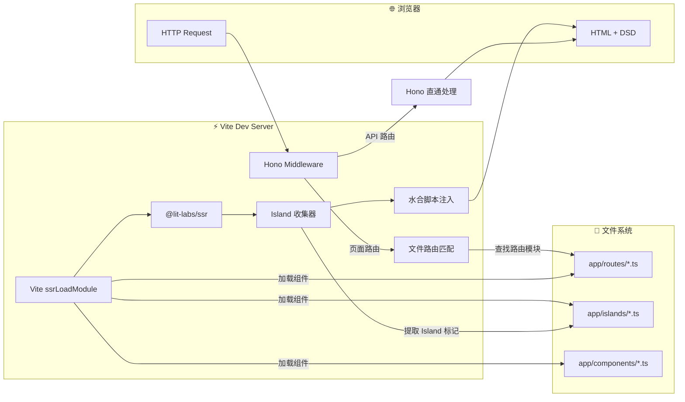
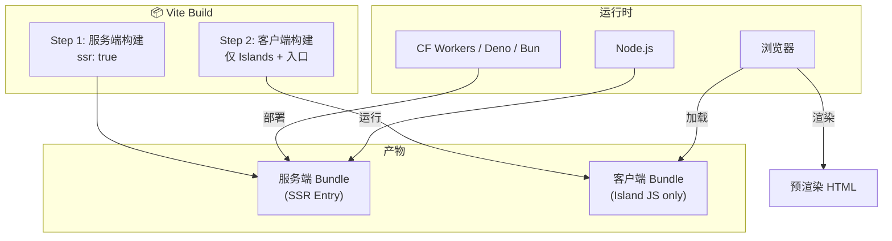
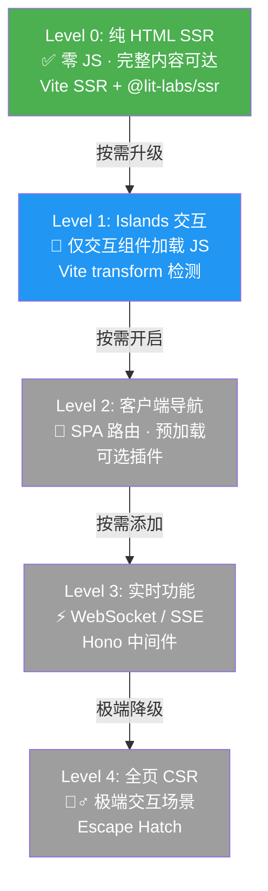
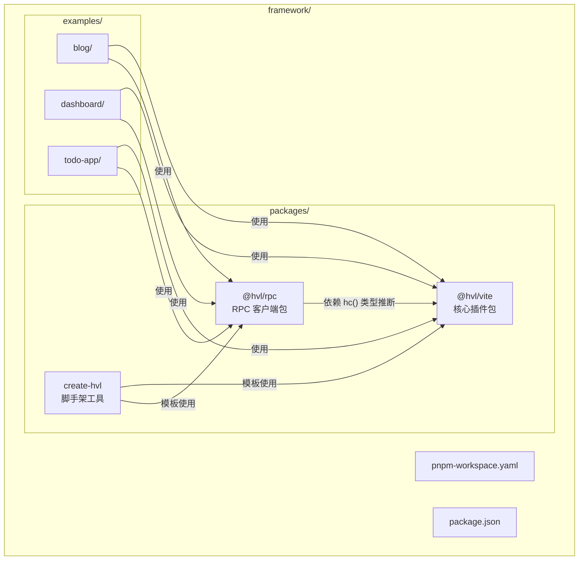
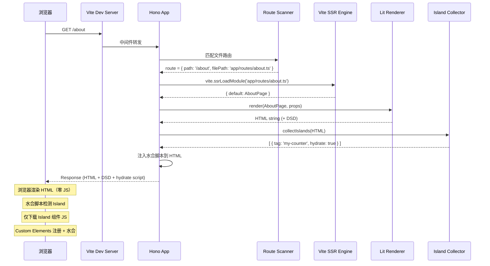
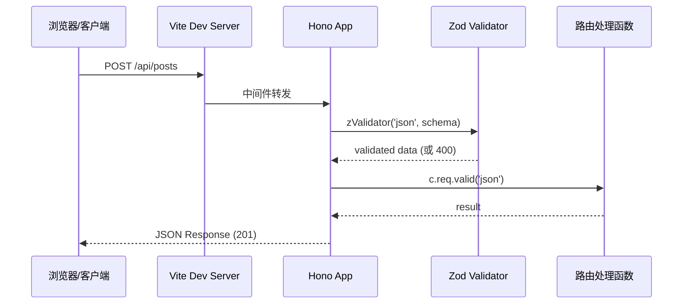
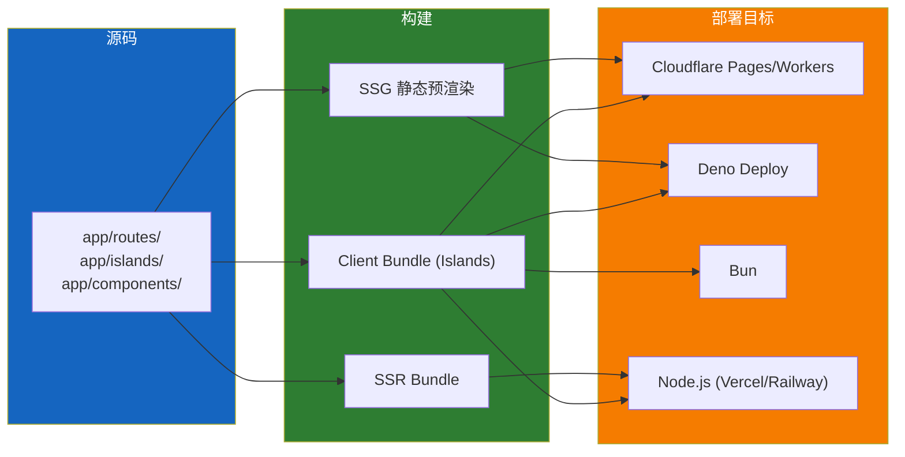
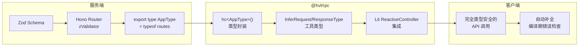

# HVL 架构设计文档

> Hono + Vite + Lit 全栈框架架构详解

---

## 1. 架构总览

### 1.1 用户视角

```typescript
// vite.config.ts — 唯一配置
import framework from '@hvl/vite'
export default defineConfig({
  plugins: [framework()]
})
```

### 1.2 插件内部架构

```
┌─────────────────────────────────────────────────────────────┐
│                    @hvl/vite (核心插件)                      │
│                                                             │
│  ┌─ configureServer ───────────────────────────────────┐   │
│  │  Hono app ← Vite middlewares                        │   │
│  │                                                      │   │
│  │  app.use('/api/*', apiMiddleware)     # API 直通    │   │
│  │  app.use('*', pageHandler)            # 页面 SSR      │   │
│  │    ├─ 文件路由匹配 (virtual:routes)                 │   │
│  │    ├─ Vite SSR 加载页面组件                           │   │
│  │    ├─ @lit-labs/ssr 渲染 → HTML                     │   │
│  │    ├─ 收集 Island → 注入水合脚本                     │   │
│  │    └─ 返回 Response                                  │   │
│  └──────────────────────────────────────────────────────┘   │
│                                                             │
│  ┌─ resolveId + load ─────────────────────────────────┐    │
│  │  virtual:routes  → 扫描 app/routes/ 生成路由表       │    │
│  │  virtual:islands → 扫描 app/islands/ 生成 Island 表 │    │
│  └─────────────────────────────────────────────────────┘    │
│                                                             │
│  ┌─ transform ────────────────────────────────────────┐    │
│  │  Island 组件 AST 标记 (__island, __tagName)          │    │
│  │  客户端入口代码自动生成                               │    │
│  └─────────────────────────────────────────────────────┘    │
│                                                             │
│  ┌─ build ───────────────────────────────────────────┐     │
│  │  Step 1: build({ ssr: true })        服务端构建     │     │
│  │  Step 2: build({ input: client.ts })  客户端构建     │     │
│  └───────────────────────────────────────────────────┘     │
│                                                             │
│  ┌─ transformIndexHtml ─────────────────────────────┐     │
│  │  注入 Island 水合脚本、样式链接、meta 标签           │     │
│  └──────────────────────────────────────────────────┘     │
└─────────────────────────────────────────────────────────────┘
```

---

## 2. 数据流

### 2.1 开发模式数据流



### 2.2 构建模式数据流



---

## 3. 渐进增强层级

### 3.1 层级模型



### 3.2 各层级输出对比

| 层级 | 首页 JS | 交互能力 | 适用场景 |
|------|---------|----------|----------|
| Level 0 | **0 KB** | 无（纯静态） | 博客文章、文档页、SEO 关键页 |
| Level 1 | **~6KB** | Island 内部交互 | 大部分 Web 应用 |
| Level 2 | **~10KB+** | SPA 导航 + 预加载 | 后台管理、仪表盘 |
| Level 3 | **~12KB+** | 实时推送 | 协作工具、聊天 |
| Level 4 | **全量** | 纯 CSR | 复杂表单、富编辑器 |

---

## 4. 包结构与依赖关系

### 4.1 Monorepo 结构



### 4.2 `@hvl/vite` 内部模块依赖

```
index.ts          ← 插件入口，导出 framework()
  ├── plugin.ts   ← 组合所有子插件为单一 Plugin[]
  │     ├── dev-server.ts         ← configureServer
  │     │     └── hono-app.ts     ← Hono 应用创建
  │     │     └── ssr-handler.ts  ← SSR + Lit 渲染协调
  │     │           └── context.ts ← 请求上下文
  │     ├── route-scanner.ts      ← resolveId/load 虚拟模块
  │     ├── island-transform.ts   ← transform Island 标记
  │     ├── island-extractor.ts   ← 构建时 Island 提取
  │     ├── build-ssr.ts          ← 服务端构建配置
  │     ├── build-client.ts       ← 客户端构建配置
  │     ├── html-template.ts      ← transformIndexHtml
  │     └── ssg.ts               ← 可选 SSG 构建
  └── types.ts     ← 公共类型定义
```

---

## 5. 请求生命周期

### 5.1 页面请求完整流程



### 5.2 API 请求流程



---

## 6. Island 架构

### 6.1 Island 工作原理

```
┌─────────────────────────────────────────────────────────┐
│                    SSR 输出的 HTML                       │
│                                                          │
│  <main>                                                  │
│    <article>                                             │
│      <h1>Hello World</h1>                                │
│      <p>这是纯静态内容，不包含任何 JS</p>                  │
│    </article>                                            │
│                                                          │
│    <my-counter>                                           │
│      <template shadowroot="open">                        │
│        <style>/* scoped styles */</style>                │
│        <button>-</button><span>0</span><button>+</button> │
│      </template>                                         │
│      <!-- Declarative Shadow DOM：浏览器原生渲染 -->       │
│    </my-counter>                                          │
│  </main>                                                 │
│                                                          │
│  <script type="module" data-islands>                      │
│    import { defineIsland } from '/@hvl/hydrate'           │
│    defineIsland('my-counter', () => import('/islands/counter.ts'))
│  </script>                                                │
└─────────────────────────────────────────────────────────┘

关键点：
1. 非 Island 内容 = 纯 HTML，无任何 JS 依赖
2. Island = Declarative Shadow DOM，浏览器直接渲染样式和结构
3. 水合脚本仅在检测到 Island 时才执行
4. 每个 Island 的 JS 独立下载、独立注册、独立水合
```

### 6.2 Island vs Component 对比

| 特性 | Island (`app/islands/`) | Component (`app/components/`) |
|------|------------------------|------------------------------|
| **SSR 渲染** | ✅ 是 | ✅ 是 |
| **客户端 JS** | ✅ 发送并水合 | ❌ 不发送 |
| **交互能力** | ✅ 有（事件监听） | ❌ 无（纯展示） |
| **Custom Element** | ✅ 自动注册 | ❌ 不注册 |
| **Shadow DOM** | ✅ 封装 | ✅ 封装 |
| **适用场景** | 计数器、表单、主题切换 | Header、Footer、卡片 |

---

## 7. 多运行时部署策略



**边缘优先策略**：
- **纯静态页面**（博客、文档）：构建时 SSG → 直接托管，无需 SSR 运行时
- **动态页面**（需要请求数据）：Node.js 运行时 + `@lit-labs/ssr` 流式渲染
- **混合场景**：静态骨架 + Island 动态注入

---

## 8. 类型安全链路



---

*文档版本：v1.0 | 最后更新：2026-04-22*
