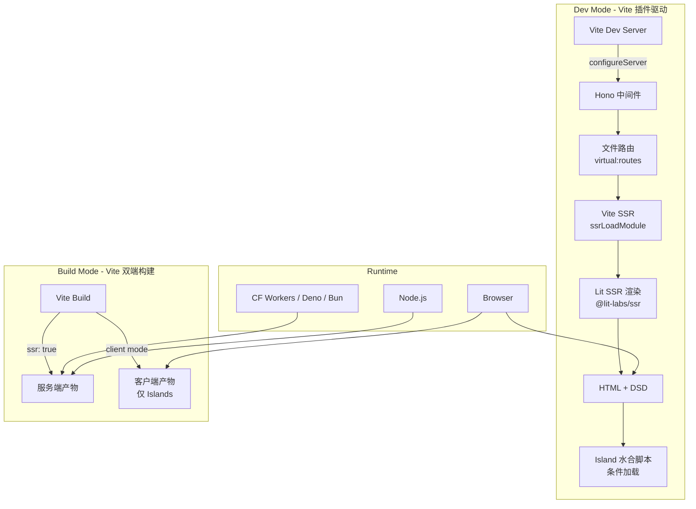

## 产品概述

构建一个基于 Hono + Vite + Lit 的全栈框架，定位为 **Web Standards 下的最小增幅渐进式全栈框架**。框架以 **单一 Vite 插件** 为核心形态，SSR 能力完全借用 Vite 内置 SSR 机制，Hono 作为 Vite 中间件集成，Lit 作为 UI 渲染层。所有技术层（HTTP、UI、构建）均建立在 Web 标准之上，不引入框架级锁定抽象。

## 核心特性

- **Vite 插件即框架**：框架 = 一个 Vite 插件，用户只需 `plugins: [framework()]`，零额外配置
- **SSR 借用 Vite 原生能力**：`server.ssrLoadModule()` 加载组件、`build.ssr` 构建服务端、`ssr.noExternal` 控制依赖，不重新发明轮子
- **Web Standards 全链路**：HTTP 层基于 Fetch API 标准（Hono），UI 层基于 Web Components 标准（Lit），构建层基于 ESM 标准（Vite）
- **最小增幅**：默认输出纯 SSR HTML（零 JS），仅对 Island 组件发送客户端 JS
- **Islands 架构 + Web Components**：每个 Island 即一个 Custom Element，天然隔离、按需水合
- **端到端类型安全**：基于 Hono RPC 实现 Server → Client 类型推断，无需代码生成
- **多运行时部署**：一套代码部署到 Cloudflare Workers / Deno / Bun / Node.js
- **Lit SSR + Declarative Shadow DOM**：服务端渲染 Lit 组件为声明式 Shadow DOM HTML

## 框架定位

| 维度 | 定位 |
| --- | --- |
| 形态 | Vite 插件（非独立框架），对 Vite 生态完全兼容 |
| 目标用户 | 追求 Web 标准、厌恶框架锁定、重视性能的开发者 |
| 核心差异 | 唯一一个全链路 Web Standards 的全栈框架，且以 Vite 插件形态存在 |
| 体积对比 | 运行时增量 < 20KB（Hono ~14KB + Lit ~6KB），vs Next.js ~300KB+ |
| 交互模型 | 默认零 JS → 按需 Island → 按需全页 CSR |
| 部署模型 | 边缘优先，多运行时自适应 |


## 可行性评估总结

- **高可行性**：Vite SSR 原生能力（`ssrLoadModule`、`build.ssr`、middleware mode）、Hono HTTP 层、文件路由（成熟模式）、多运行时部署
- **中可行性**：Lit SSR + Vite SSR 集成（`@lit-labs/ssr` 需适配 Vite 的模块加载）、Islands + Lit 水合（需自研但路径清晰）、端到端类型安全（Hono RPC 成熟）
- **需攻克的关键挑战**：`@lit-labs/ssr` 在 Vite SSR 环境下的模块解析、Declarative Shadow DOM 降级方案、Island AST 检测与选择性水合

## 技术栈

| 层 | 技术 | 版本 | 选型理由 |
| --- | --- | --- | --- |
| HTTP | Hono | ^4.x | Web Standards 原生、零依赖、多运行时、内置 RPC |
| UI | Lit | ^3.x | Web Components 标准、5KB 运行时、Shadow DOM 封装 |
| 构建 | Vite | ^6.x | ESM 原生、极速 HMR、SSR 支持、插件生态 |
| SSR | @lit-labs/ssr | ^1.x | Lit 官方 SSR 方案、Declarative Shadow DOM |
| 验证 | Zod | ^3.x | 与 Hono zodValidator 集成、RPC 类型推断 |
| 类型 | TypeScript | ^5.x | 端到端类型安全基础 |
| 包管理 | Deno | ^2.x | 内置依赖管理、workspace 支持 |


## 实现方案

### 总体策略：Vite 插件为核心

框架以 **单一 Vite 插件** 为核心形态，所有能力通过 Vite 插件钩子实现：

| 框架能力 | Vite 钩子/能力 | 实现方式 |
| --- | --- | --- |
| 开发服务器 | `configureServer` | 注入 Hono 为 Vite 中间件，处理路由请求 |
| SSR 渲染 | `server.ssrLoadModule()` | Vite 加载 Lit 组件 → `@lit-labs/ssr` 渲染 → HTML |
| 文件路由 | `resolveId` + `load` | 虚拟模块 `virtual:routes`，扫描 `app/routes/` |
| Island 检测 | `transform` | AST 分析 Island 组件，注入水合标记 |
| 双端构建 | `build` 钩子 | 服务端 `build.ssr` + 客户端 `build.rollupOptions` |
| HMR | Vite 内置 | 组件变更 → Vite HMR → 自动重渲染 |
| HTML 模板 | `transformIndexHtml` | 注入 Island 水合脚本、样式链接 |


### 架构设计

```
用户视角：vite.config.ts
┌─────────────────────────────────────────┐
│  import framework from '@hvl/vite'      │
│  export default defineConfig({           │
│    plugins: [framework()]                │
│  })                                      │
└──────────────┬──────────────────────────┘
               │
┌──────────────▼──────────────────────────┐
│         @hvl/vite (核心插件)             │
│                                          │
│  ┌─ configureServer ──────────────────┐  │
│  │  Hono app ← Vite middlewares       │  │
│  │  app.use('*', honoHandler)          │  │
│  │  honoHandler:                       │  │
│  │    1. 文件路由匹配                  │  │
│  │    2. Vite SSR 加载页面组件         │  │
│  │    3. @lit-labs/ssr 渲染 → HTML    │  │
│  │    4. 注入 Island 水合脚本          │  │
│  │    5. 返回 Response                 │  │
│  └────────────────────────────────────┘  │
│                                          │
│  ┌─ resolveId + load ────────────────┐   │
│  │  virtual:routes → 文件路由表       │   │
│  │  virtual:islands → Island 映射表   │   │
│  └────────────────────────────────────┘  │
│                                          │
│  ┌─ transform ───────────────────────┐   │
│  │  Island 组件 AST 标记              │   │
│  │  客户端入口代码生成                │   │
│  └────────────────────────────────────┘  │
│                                          │
│  ┌─ build ───────────────────────────┐   │
│  │  Step 1: 服务端构建 (ssr: true)    │   │
│  │  Step 2: 客户端构建 (Islands only) │   │
│  └────────────────────────────────────┘  │
└──────────────────────────────────────────┘
```



### 关键技术决策

#### 1. Vite SSR 驱动 Lit 渲染

Vite 内置 SSR 能力是核心，不做重复实现：

```typescript
// configureServer 钩子中：Vite SSR 加载 + Lit 渲染
async function handleSSR(vite: ViteDevServer, route: RouteMatch) {
  // 1. Vite SSR 加载页面模块
  const module = await vite.ssrLoadModule(route.filePath)
  const Page = module.default
  
  // 2. @lit-labs/ssr 渲染 Lit 组件
  const { render } = await import('@lit-labs/ssr')
  const result = render(Page, route.props)
  
  // 3. 收集 Island → 注入水合脚本
  const html = await collectAndInjectIslands(result)
  
  return new Response(html, {
    headers: { 'content-type': 'text/html' }
  })
}
```

**边缘运行时 vs Node.js 双层策略**：

- **边缘运行时**：构建时预渲染为 Declarative Shadow DOM 静态 HTML，无需 SSR 运行时
- **Node.js 运行时**：运行时使用 `@lit-labs/ssr` 流式渲染，支持动态内容

#### 2. Hono 作为 Vite 中间件

Hono 不独立启动服务器，而是注册为 Vite Dev Server 的中间件：

```typescript
// vite-plugin/src/dev-server.ts
export function frameworkDevServer(): Plugin {
  return {
    name: 'framework-dev-server',
    configureServer(server) {
      const app = new Hono()
      
      // API 路由：直接由 Hono 处理
      app.use('/api/*', apiMiddleware)
      
      // 页面路由：Vite SSR + Lit 渲染
      app.use('*', async (c) => {
        const url = new URL(c.req.url)
        const route = matchRoute(url.pathname)
        if (!route) return c.notFound()
        const html = await handleSSR(server, route)
        return c.html(html)
      })
      
      // 注入 Hono 到 Vite
      return () => {
        server.middlewares.use(async (req, res, next) => {
          const response = await app.fetch(createRequest(req))
          if (response) return sendResponse(res, response)
          next()
        })
      }
    }
  }
}
```

#### 3. 文件路由 via Vite 虚拟模块

```typescript
export function routeScannerPlugin(): Plugin {
  const virtualId = 'virtual:routes'
  return {
    name: 'framework-route-scanner',
    resolveId(id) { if (id === virtualId) return '\0' + virtualId },
    async load(id) {
      if (id !== '\0' + virtualId) return
      const routes = await scanRoutes('./app/routes')
      return `
        ${routes.map(r => `import * as ${r.varName} from '${r.filePath}'`).join('\n')}
        export const routes = [
          ${routes.map(r => `{ path: '${r.path}', module: ${r.varName} }`).join(',')}
        ]
      `
    }
  }
}
```

#### 4. Island 检测 via Vite transform 钩子

```typescript
export function islandTransformPlugin(): Plugin {
  return {
    name: 'framework-island-transform',
    transform(code, id) {
      if (!id.includes('/app/islands/')) return
      return `
        ${code}
        if (typeof customElements !== 'undefined') {
          customElements.define('${getTagName(id)}', exports.default)
        }
        export const __island = true
        export const __tagName = '${getTagName(id)}'
      `
    }
  }
}
```

#### 5. 双端构建

```typescript
export function frameworkBuildPlugin(): Plugin {
  return {
    name: 'framework-build',
    async build() {
      // Step 1: 服务端构建
      await build({ build: { ssr: true }, ssr: { noExternal: ['lit', '@lit-labs/ssr'] } })
      // Step 2: 客户端构建（仅 Islands + 入口）
      await build({ rollupOptions: { input: { client: 'app/client.ts' } } })
    }
  }
}
```

#### 6. Hono RPC 集成

```typescript
// 服务端：路由定义 + 验证
const routes = app.post('/api/posts',
  zValidator('json', z.object({ title: z.string() })),
  (c) => c.json({ ok: true }, 201)
)
export type AppType = typeof routes

// 客户端：自动类型推断
import { hc } from '@hvl/rpc'
const client = hc<AppType>('/')
const res = await client.api.posts.$post({ json: { title: 'Hello' } })
```

#### 7. 渐进增强层级

```
Level 0: 纯 HTML SSR（零 JS，完整内容可达）—— Vite SSR + @lit-labs/ssr 输出
Level 1: Islands 交互（仅交互组件加载 JS）—— Vite transform 检测 + 条件加载
Level 2: 客户端导航（SPA 路由，预加载）—— 可选插件
Level 3: 实时功能（WebSocket/SSE，可选）—— Hono WebSocket 中间件
Level 4: 全页 CSR（极端交互场景，可选降级）—— 框架提供 escape hatch
```

### 包结构（精简为 2+1）

```
framework/                              # 框架仓库根目录
├── packages/
│   ├── vite/                           # [核心] Vite 插件包（框架本体）
│   │   ├── src/
│   │   │   ├── index.ts                # 插件主入口，导出 framework() 函数
│   │   │   ├── dev-server.ts           # configureServer：Hono 中间件注入
│   │   │   ├── ssr-handler.ts          # Vite SSR 加载 + Lit 渲染协调
│   │   │   ├── route-scanner.ts        # resolveId/load：virtual:routes 虚拟模块
│   │   │   ├── island-transform.ts     # transform：Island AST 检测 + 注册
│   │   │   ├── island-extractor.ts     # 构建时 Island 提取与映射表生成
│   │   │   ├── build.ts               # 双端构建（SSR + Client）
│   │   │   ├── html-template.ts        # transformIndexHtml：HTML 文档模板
│   │   │   ├── context.ts              # 请求上下文（跨 SSR/Island）
│   │   │   ├── errors.ts              # 类型化错误层级
│   │   │   └── types.ts                # 公共类型定义
│   │   ├── vite.config.build.ts        # Vite library mode 构建配置
│   │   ├── deno.json
│   │   └── package.json
│   │
│   ├── rpc/                            # [独立] RPC 客户端包
│   │   ├── src/
│   │   │   └── index.ts                # hc() + RpcError + RpcController + rpcFetch
│   │   ├── vite.config.build.ts        # Vite library mode 构建配置
│   │   ├── deno.json
│   │   └── package.json
│   │
│   └── create/                         # [脚手架] 项目创建工具
│       ├── src/
│       │   ├── index.ts                # CLI 入口
│       │   └── templates/              # 内联模板
│       │       ├── minimal/            # 最小（纯 SSR）
│       │       ├── standard/           # 标准（SSR + Islands）
│       │       └── full/               # 完整（SSR + Islands + RPC + API）
│       ├── package.json                # name: create-hvl
│       └── tsconfig.json
│
├── examples/                           # 示例应用
│   ├── blog/                           # 博客（SSG + Islands）
│   ├── dashboard/                      # 仪表盘（SSR + RPC）
│   └── todo-app/                       # Todo（全功能）
│
├── deno.json
├── package.json
└── README.md
```

### 用户项目结构（模板）

```
my-app/                                 # 用户项目
├── app/
│   ├── routes/                         # 文件路由
│   │   ├── index.ts                    # 首页
│   │   ├── about.ts                    # /about
│   │   ├── _renderer.ts                # 布局渲染器
│   │   ├── _middleware.ts              # 中间件
│   │   └── api/
│   │       └── posts.ts                # API 路由（Hono）
│   ├── islands/                        # Island 组件（自动检测）
│   │   ├── counter.ts                  # Lit Island
│   │   └── theme-toggle.ts             # Lit Island
│   ├── components/                     # 普通 Lit 组件（SSR only）
│   │   ├── header.ts
│   │   └── footer.ts
│   ├── server.ts                       # 服务端入口（导出 Hono app）
│   └── client.ts                       # 客户端入口（Island 水合）
├── public/                             # 静态资源
├── package.json
├── vite.config.ts                      # 只需 plugins: [framework()]
└── tsconfig.json
```

### 实现要点

#### 性能考量

- **Vite SSR 缓存**：开发模式下 Vite 自动缓存 `ssrLoadModule` 结果，模块变更时智能失效
- **Island 提取**：构建时通过 `transform` 钩子 AST 分析 Island 依赖图，仅打包 Island 到客户端
- **SSR 静态缓存**：边缘运行时使用构建时预渲染结果，Node.js 运行时支持动态渲染
- **Shadow DOM CSS**：Lit 组件样式在 SSR 时内联到 Declarative Shadow DOM，避免 FOUC

#### 兼容性与降级

- **Declarative Shadow DOM**：Chrome 90+ / Safari 16.4+ / Firefox 123+ 原生支持；旧浏览器通过 polyfill 降级
- **Vite SSR 限制**：边缘运行时无法使用 `ssrLoadModule`（Node.js only），需构建时预渲染
- **零 JS 降级**：Island 水合脚本条件加载，无 Island 时零 JS 输出

#### 错误处理

- **SSR 错误**：Lit 组件渲染失败时降级为 Error Boundary 占位符
- **水合错误**：客户端水合失败回退到完整 CSR 渲染
- **RPC 错误**：统一错误类型，自动映射 HTTP 状态码

#### 日志

- 开发模式：Vite 终端 + 彩色路由注册/SSR 耗时/Island 检测输出
- 生产模式：Hono 结构化 JSON 日志，携带请求 ID

## Agent Extensions

### SubAgent

- **code-explorer**
- Purpose: 验证 Vite 插件 API 使用方式、@lit-labs/ssr 接口兼容性
- Expected outcome: 确保插件钩子使用正确，Lit SSR 集成方案可行

### Skill

- **fullstack-dev-engineer**
- Purpose: 框架架构设计决策参考、Vite 插件架构最佳实践
- Expected outcome: Vite 插件架构遵循最佳实践

- **GitHub热门项目**
- Purpose: 研究 Vite 插件生态中类似的全栈框架实现（如 vite-plugin-ssr/vite-ssg）
- Expected outcome: 借鉴成熟 Vite SSR 插件的实现模式